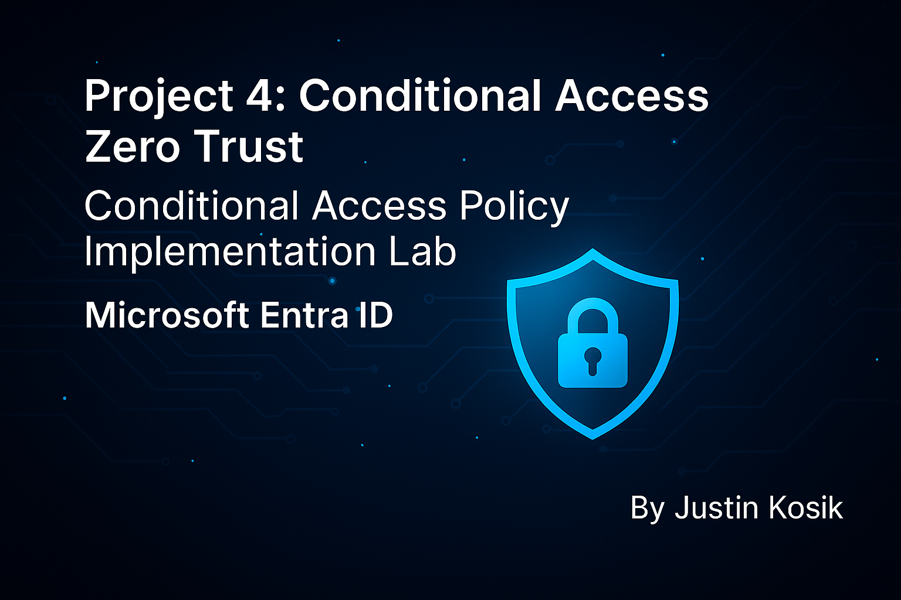
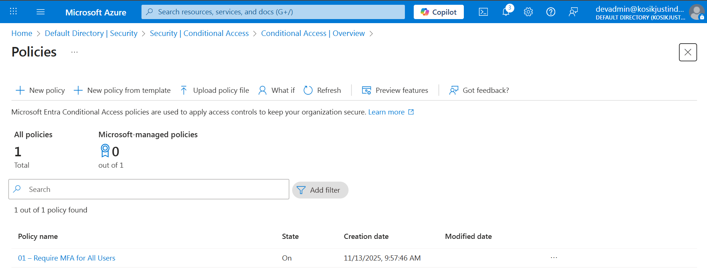

<p align="center">
  
</p>

<h1 align="center">🛑 Project 4 — Entra ID Zero Trust Conditional Access</h1>
<h3 align="center">Risk-Based Policies ▸ Geo Blocking ▸ Legacy Auth Blocking ▸ Break-Glass Ready</h3>

---

## 🟦 Why This Project Matters to IAM Hiring Managers

Conditional Access is the **core enforcement engine of Zero Trust.**  
Most candidates only show “Require MFA” — this project proves full enterprise governance.

What this proves I can do:

✔ Enforce MFA for every sign-in  
✔ Block legacy authentication protocols  
✔ Restrict access by named location  
✔ Use group-based governance (not user targeting)  
✔ Maintain break-glass resilience  
✔ Capture BEFORE/AFTER enforcement evidence

These skills are required for:

🟦 IAM Analysts  
🟦 Identity Governance Specialists  
🟦 Azure Security / Entra Engineers  
🟦 SOC IAM Support Roles

---

## 📚 Table of Contents

- [Objectives](#-objectives)
- [Zero Trust Requirements](#-zero-trust-requirements)
- [Architecture](#-architecture)
- [Groups Created](#-groups-created)
- [Conditional Access Policies](#-conditional-access-policies)
- [Named Location + Geo Logic](#-named-location--geo-logic)
- [Policy Enforcement Evidence](#-policy-enforcement-evidence)
- [What I Learned](#-what-i-learned)
- [Repo Structure](#-repo-structure)

---

## 🎯 Objectives

| Goal | Result |
|------|--------|
| Require MFA for every user | ✔ Enforced |
| Block sign-ins outside US | ✔ Geo restricted |
| Block legacy auth | ✔ SMTP / IMAP / POP / ActiveSync blocked |
| Maintain break-glass paths | ✔ Resilient |
| Group-based assignment | ✔ No direct user targeting |
| Capture screenshots as audit evidence | ✔ Completed |

---

## 🛡 Zero Trust Requirements

This project matches Microsoft’s official Zero Trust model:

🔹 **Verify Explicitly** — MFA, location, client, risk  
🔹 **Least Privilege Access** — groups, not users  
🔹 **Assume Breach** — legacy auth blocked, break-glass protected  

---
## 🏗 Architecture

```text
Users → Governance Groups → Conditional Access Policies
                 │
        Named Locations (USA only)
                 │
        MFA enforced everywhere
```

---

## 👥 Groups Created (Governance Structure)

<details>
<summary><strong>📌 Zero Trust Governance Groups</strong></summary>

| Group | Purpose |
|-------|---------|
| zt_all_users | All cloud identities |
| zt_admins | Security / admin users |
| zt_breakglass | Emergency bypass |
| zt_trusted_locations | Named location scoping |

📸 Screenshots  
  
  
  
  
  
  


</details>

---

## ✈ Named Location & Geo Logic

<details>
<summary><strong>🌍 Named Location: United States</strong></summary>


</details>

---

## 🛑 Conditional Access Policies

---

### 🔹 **POLICY 01 — Require MFA for All Users**

<details>
<summary><strong>📋 Policy Overview</strong></summary>

  
  
  
  


</details>

---

### 🔹 **POLICY 02 — Block Non-US Access**

<details>
<summary><strong>📋 Policy Overview</strong></summary>

  
  
  


</details>

---

### 🔹 **POLICY 03 — Block Legacy Authentication**

<details>
<summary><strong>📋 Policy Overview</strong></summary>

  
  
  


</details>

---

## 🧾 Policy List Proof


---

## 🧠 What I Learned

✔ Conditional Access must be **group-based** to scale  
✔ Legacy auth must be explicitly blocked — NOT automatic  
✔ Break-glass paths must be excluded or companies lock themselves out  
✔ Named locations are required to enforce geo-restrictions safely  
✔ IAM portfolios MUST provide evidence — not just claims

---

## 📂 Repo Structure

```text
Project-4-Zero-Trust-Conditional-Access/
│ README.md
└── screenshots/
    CA-Zero-Trust-Banner.png
    conditional-access-policy-list.png
    named-location-united-states.png
    zt-group-allusers-created.png
    zt-group-allusers-members.png
    zt-group-admins-created.png
    zt-group-admins-members.png
    zt-group-breakglass-created.png
    zt-group-breakglass-members.png
    zt-group-trustedlocations-created.png
    CA-Policy01-Assignments.png
    CA-Policy01-Conditions.png
    CA-Policy01-Grant.png
    CA-Policy01-Overview.png
    CA-Policy02-Assignments.png
    CA-Policy02-Conditions-Locations.png
    CA-Policy02-Grant.png
    CA-Policy02-Overview.png
    CA-Policy03-Assignments.png
    CA-Policy03-Conditions-ClientApps.png
    CA-Policy03-Grant.png
    CA-Policy03-Overview.png
    Policy-01-Require-MFA.png.png
