<p align="center">
  
</p>

# 🛡️ Project 4 — Entra ID (Azure AD) Conditional Access Zero Trust
_Identity Perimeter • Least Privilege • Modern Access Control_


---

<details open>
  <summary><h2>📚 Table of Contents</h2></summary>

- [Objective](#objective)
- [Zero Trust Architecture](#zero-trust-architecture)
- [Zero Trust Governance Groups](#zero-trust-governance-groups)
- [Named Location — United States](#named-location--united-states)
- [Policy 01 — Require MFA for All Users](#policy-01--require-mfa-for-all-users)
- [Policy 02 — Block Sign-ins From Outside the United-States](#policy-02--block-sign-ins-from-outside-the-united-states)
- [Policy 03 — Block Legacy Authentication](#policy-03--block-legacy-authentication)
- [Evidence & Screenshots](#evidence--screenshots-audit-artifacts)
- [Repo Structure](#repo-structure)

</details>

---

<details open>
 <summary><h2 id="objective">🎯 Objective</h2></summary>

This project demonstrates a **Zero Trust Conditional Access architecture** in Microsoft Entra ID.

Implemented controls:

- 🔐 **Require MFA for all users** (baseline identity hardening)  
- 🌎 **Block sign-ins from outside the United States** (location risk reduction)  
- 🛑 **Block legacy authentication protocols** (POP/IMAP/SMTP/ActiveSync)  
- 🧩 **Zero Trust governance groups** (Admins, AllUsers, BreakGlass, TrustedLocations)  
- 🗺️ **Trusted Named Location — United States**

This Zero Trust implementation aligns with Microsoft’s recommended baseline for modern identity security in cloud environments.

</details>

---

<details open>
  <summary><h2 id="zero-trust-architecture">🏗️ Zero Trust Architecture</h2></summary>

Zero Trust in Entra ID follows three fundamental principles:

### 🔹 **1. Verify Explicitly**
Authentication strength and device posture are validated for every session.

### 🔹 **2. Use Least Privilege**
Access is restricted by identity type, device state, location, and admin tiering.

### 🔹 **3. Assume Breach**
Deny access when risk is detected, legacy protocols are used, or geographic anomalies appear.

---

### ⚡ Architecture Summary
This project enforces:

- MFA → identity verification  
- Device posture → compliant device for admins  
- Geography → US-only sign-ins  
- Protocol hardening → legacy auth blocked  
- BreakGlass account → compliant escape hatch  

</details>

---

<details open>
  <summary><h2 id="zero-trust-governance-groups">👥 Zero Trust Governance Groups</h2></summary>

To support a clean and scalable architecture, four governance groups were created.

---

### **GG-ZT-Admins**  
Used to apply stricter policies to administrative identities.  
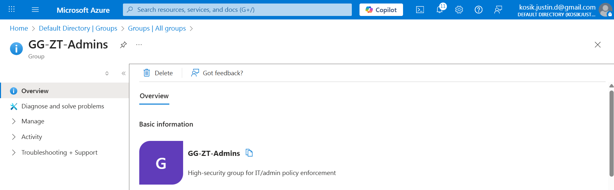  
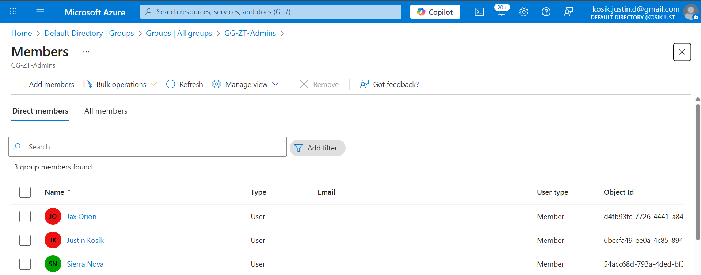

---

### **GG-ZT-AllUsers**  
A broad group representing the standard user population.  
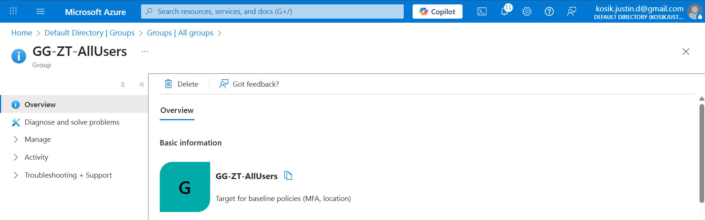  
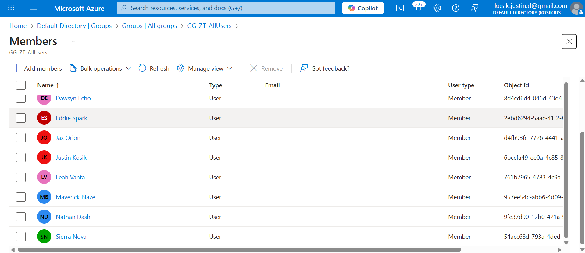

---

### **GG-ZT-BreakGlass**  
Critical exclusion account for emergencies.  
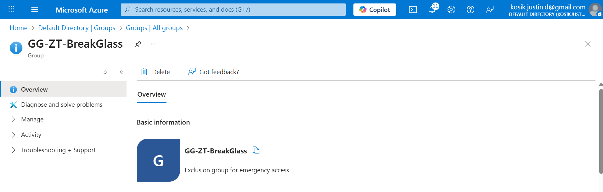  


---

### **GG-ZT-TrustedLocations**  
Supports Named Location governance.  
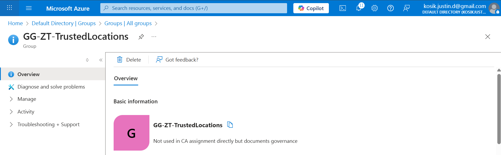

</details>

---

<details open>
  <summary><h2 id="named-location--united-states">🗺️ Named Location — United States</h2></summary>

The **United States** was created as a **trusted location** to enforce geo-based access controls.

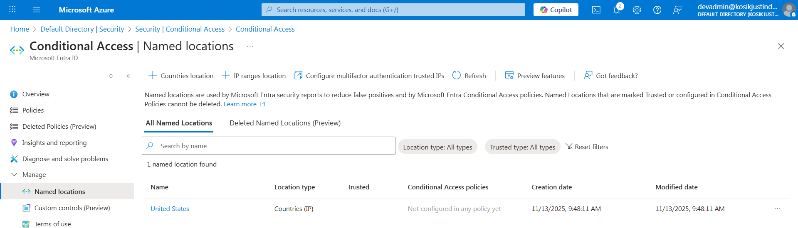

</details>

---

<details open>
  <summary><h2 id="policy-01--require-mfa-for-all-users">🔐 Policy 01 — Require MFA for All Users</h2></summary>

### **Policy Name:**  
`CA-ZT-RequireMFA-AllUsers`

---

### ✅ **Assignments**
Targeted all users while excluding the BreakGlass account.

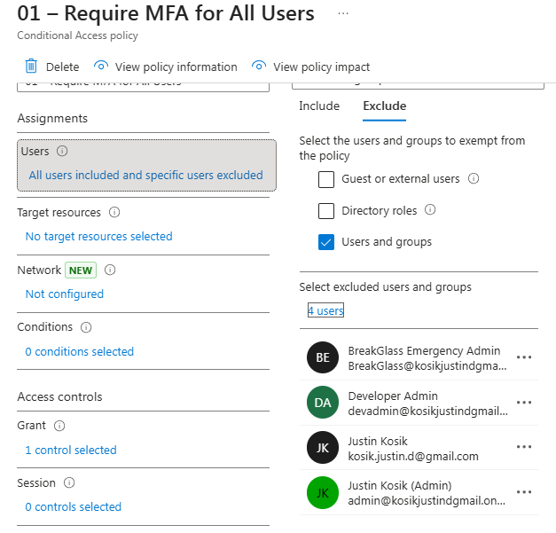

---

### ✅ **Conditions**
No additional conditions required; applies universally.

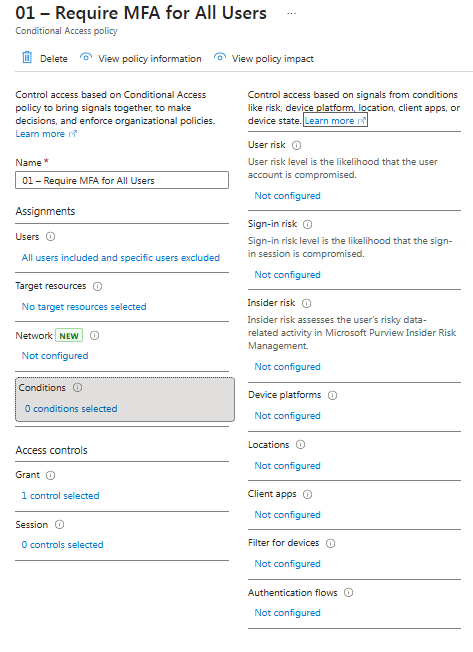

---

### ✅ **Grant Controls**
- **Require MFA**

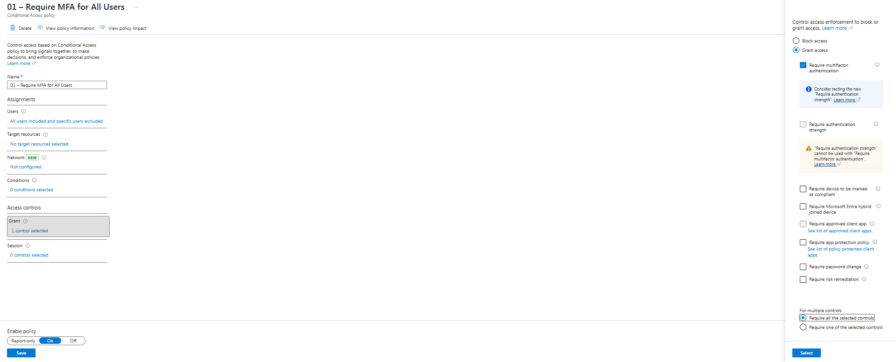

---

### 🎉 **Final Overview**
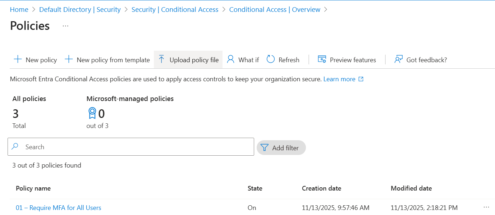

</details>

---

<details open>
  <summary><h2 id="policy-02--block-sign-ins-from-outside-the-united-states">🌎 Policy 02 — Block Sign-ins From Outside the United States</h2></summary>

### **Policy Name:**  
`CA-ZT-Block-NonUS`

---

### ✅ **Assignments**
Applies to all users except BreakGlass.

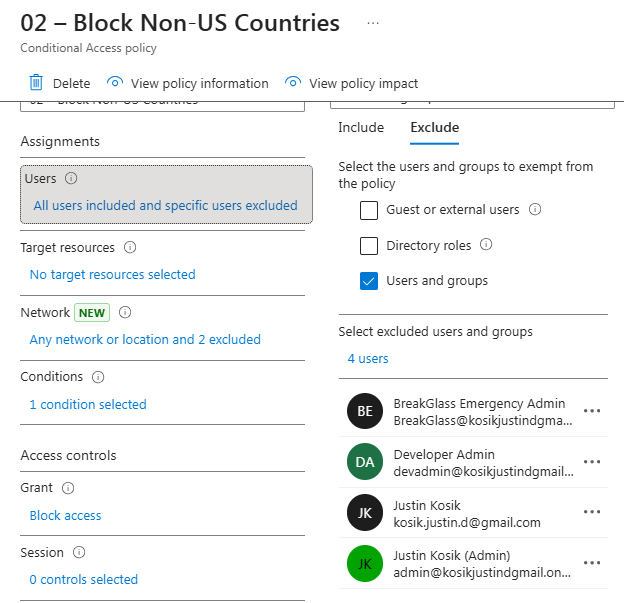

---

### ✅ **Conditions**
Sign-ins from **outside the U.S.** are included and blocked.

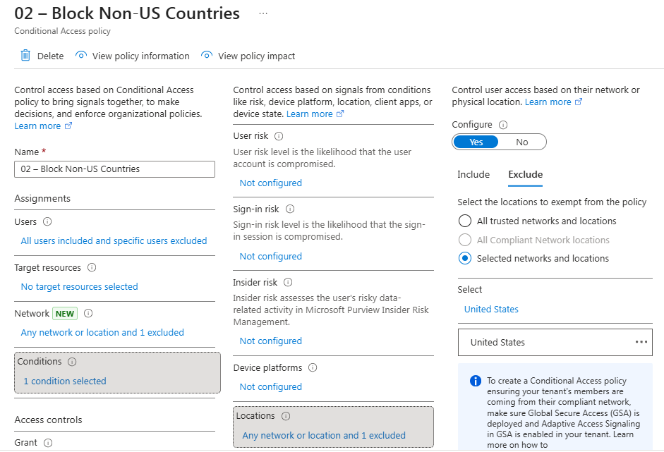

---

### ✅ **Grant Controls**
- **Block Access**

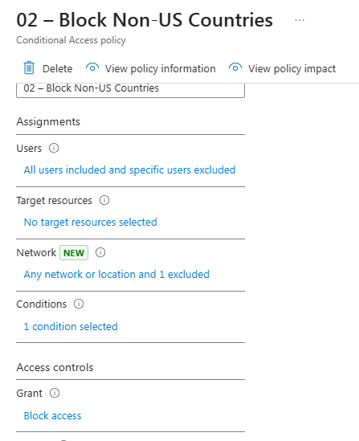

---

### 🎉 **Final Overview**
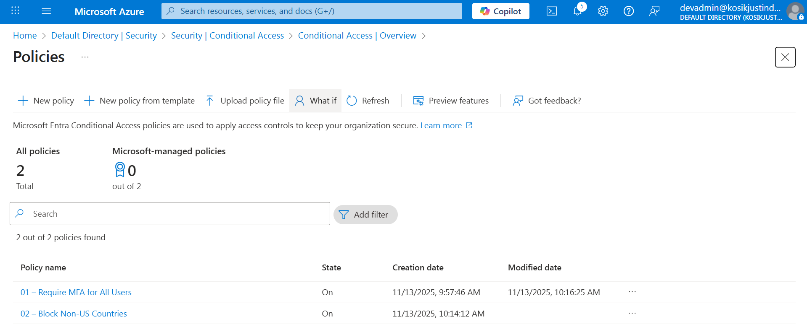

</details>

---

<details open>
  <summary><h2 id="policy-03--block-legacy-authentication">🛑 Policy 03 — Block Legacy Authentication</h2></summary>

### **Policy Name:**  
`CA-ZT-Block-Legacy`

Legacy protocols bypass MFA and modern token protections. This policy blocks:

- IMAP  
- POP  
- SMTP auth  
- ActiveSync  
- MAPI  
- Older Office clients  

---

### ✅ **Assignments**
Targeted all users except BreakGlass.

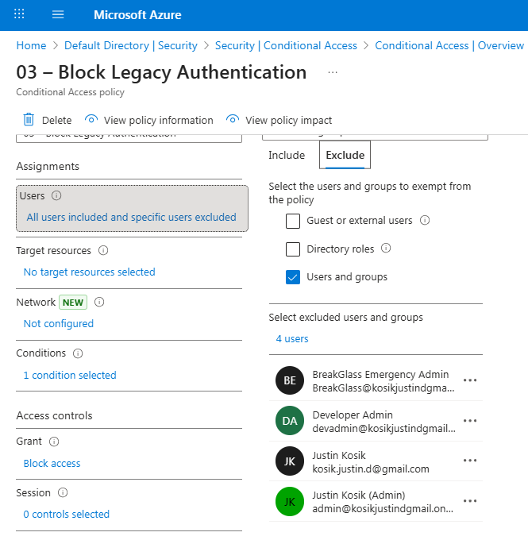

---

### ✅ **Conditions**
Client apps restricted to legacy authentication.

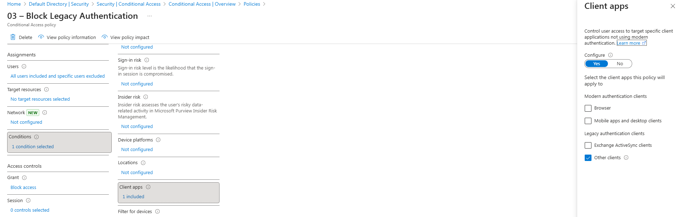

---

### ✅ **Grant Controls**
- **Block Access**

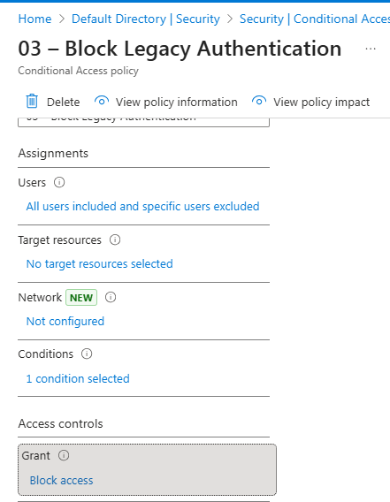

---

### 🎉 **Final Overview**
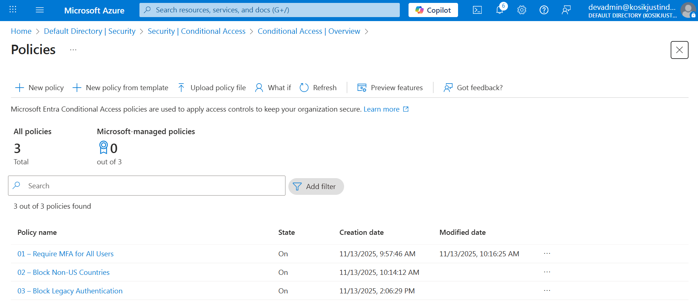

</details>

---

<details>
  <summary><h2 id="evidence--screenshots-audit-artifacts">🧪 Evidence & Screenshots (Audit Artifacts)</h2></summary>

### 📄 Conditional Access Overview  
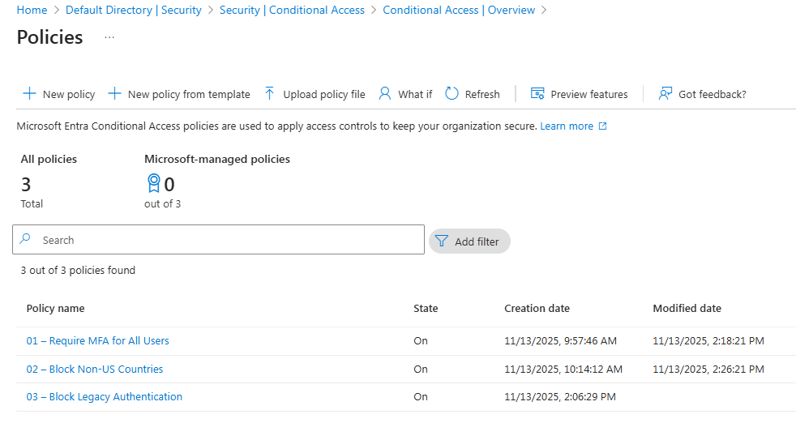

### 🧩 Zero Trust Group Snapshots  
(See Governance Groups section above)

### 🌎 Named Location  


</details>

---

<details>
  <summary><h2 id="repo-structure">📂 Repo Structure</h2></summary>

```text
project-4-entra-id-conditional-access-zero-trust/
│ README.md
└── screenshots/
    ├─ zt_banner.png
    ├─ zt-group-admins-created.png
    ├─ zt-group-admins-members.png
    ├─ zt-group-allusers-created.png
    ├─ zt-group-allusers-members.png
    ├─ zt-group-breakglass-created.png
    ├─ zt-group-breakglass-members.png
    ├─ zt-group-trustedlocations-created.png
    ├─ named-location-united-states.png
    ├─ CA-Policy01-Assignments.png
    ├─ CA-Policy01-Conditions.png
    ├─ CA-Policy01-Grant.png
    ├─ CA-Policy01-Overview.png
    ├─ CA-Policy02-Assignments.png
    ├─ CA-Policy02-Conditions-locations.png
    ├─ CA-Policy02-Grant.png
    ├─ CA-Policy02-Overview.png
    ├─ CA-Policy03-Assignments.png
    ├─ CA-Policy03-Conditions-clientapps.png
    ├─ CA-Policy03-Grant.png
    ├─ CA-Policy03-Overview.png
    └─ conditional-Access-Policy-List.png
```

</details>
